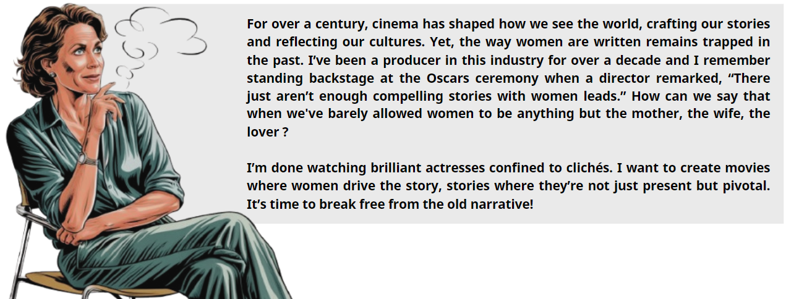

<<<<<<< Updated upstream
<!-- The letter displayed initially -->

  
A

=======

  

  

    We’re here to help you turn your vision into reality! Through our analysis, we will help you create a movie that not only shines at the box office but sets a new benchmark for equality in cinema. We'll guide you through the key ingredients for crafting a movie that is as inclusive as it is successful.
    Because while inclusivity is the mission, success is the name of the game and our recommendations are designed to deliver both. So, let’s pull back the curtain on the current industry and explore the challenges that stand between you and a truly groundbreaking, inclusive movie. Together, let’s rewrite the narrative...
  

# Behind the curtain: The current state of women in cinema

  <!-- Text Section -->
  

    

      To truly understand the challenges women face in the film industry, we must first examine the current landscape.
       
      This visualization highlights the current gender distribution in cinema, underscoring the imbalance that persists. 
      As expected, a significant difference is observed in the number of actors between men and women. Now, the question is: even if women have always been underrepresented in cinema since its inception, has their representation increased over the years?
    

  

  <!-- gender distribution -->
  

    <iframe src="assets/gender_distribution.html" width="100%" height="430px" style="border: none;"></iframe>
  

>>>>>>> Stashed changes

<<<<<<< Updated upstream
  

    <!-- Marine's message -->
    

      

        
      

      

        For over a century, cinema has shaped how we see the world, crafting our stories and reflecting our cultures. Yet, the way women are written remains trapped in the past. I’ve been a producer in this industry for over a decade and I remember standing backstage at the Oscars ceremony when a director remarked, “There just aren’t enough compelling stories with women leads.” How can we say that when we've barely allowed women to be anything but the mother, the wife, the lover ? 
        I’m done watching brilliant actresses confined to clichés. I want to create movies where women drive the story, stories where they’re not just present but pivotal. It’s time to break free from the old narrative!
      

    

    <!-- Marco's typing effect (appears first) -->
    

      

        
      

      

        

          
          
          
        

      

    

    <!-- Marco's response (appears after typing) -->
    

      

        
      

      

        We’re here to help you turn your vision into reality! Through our analysis, we will help you create a movie that not only shines at the box office but sets a new benchmark for equality in cinema. We'll guide you through the key ingredients for crafting a movie that is as inclusive as it is successful. Because while inclusivity is the mission, success is the name of the game and our recommendations are designed to deliver both. So, let’s pull back the curtain on the current industry and explore the challenges that stand between you and a truly groundbreaking, inclusive movie. Together, let’s rewrite the narrative...
      

    

      
  <!-- Include your JavaScript file at the end of the body section -->

  # Behind the curtain: The current state of women in cinema

  

    <!-- Text Section -->
    

      

        To truly understand the challenges women face in the film industry, we must first examine the current landscape.
         
        This visualization highlights the current gender distribution in cinema, underscoring the imbalance that persists. 
        As expected, a significant difference is observed in the number of actors between men and women. Here, men represent 
        66.18% of the actors, while women account for 33.82%. Now, the question is: even if women have always been 
        underrepresented in cinema since its inception, has their representation increased over the years?
      

    

    <!-- gender distribution -->
    

      <iframe src="assets/gender_distribution.html" width="100%" height="430px" style="border: none;"></iframe>
    

  

  

    <!-- gender distribution over the year -->
    

      <iframe src="assets/gender_distribution_years.html" width="100%" height="600px" style="border: none;"></iframe>
    

  

  

    <!-- Actor ratio per movie over the years -->
    

      <iframe src="assets/actor_ratio_per_movie.html" width="100%" height="600px" style="border: none;"></iframe>
    

  

  

    <!-- pourcentage women by genre -->
    

      <iframe src="assets/pourcentage_women_by_genre.html" width="100%" height="600px" style="border: none;"></iframe>
    

  

  ## Top Tropes for Women and Men in Cinema

  Understanding the most common character tropes for women and men in cinema provides insight into how gender roles have been historically depicted. The visualizations below highlight the top tropes for female and male characters.

  ### Top Tropes for Women

  

    

      <iframe src="assets/top_tropes_women.html" width="100%" height="500px" style="border: none;"></iframe>
    

  

  ### Top Tropes for Men

  

    

      <iframe src="assets/top_tropes_men.html" width="100%" height="500px" style="border: none;"></iframe>
    

  

  # The Bechdel Score

  ### The Bechdel Test

  

    
<strong>Film Director:</strong> I’ve heard about this interesting metric called the Bechdel Test. It’s a great starting point to evaluate how inclusive a movie is when it comes to gender representation. Let me walk you through it:

    
    
The Bechdel Test is based on three simple criteria:

    <ol style="margin: 15px auto; padding-left: 20px; max-width: 1200px; list-style-position: outside; text-align: justify;">
      <li>Does the film have at least two named women?</li>
      <li>Do these women talk to each other?</li>
      <li>Do they discuss something other than a man?</li>
    </ol>
    
    
It might sound simple, but you’d be surprised how many films fail to meet these basic requirements. While the test doesn’t capture everything about inclusivity, it’s a valuable tool for spotting patterns in storytelling. Let’s take a look at the results from various regions and years to see how movies perform.

  

  ### Visualizing the Bechdel Test Results

  Along the years: Avg bechdel test result

  

    

      <iframe src="assets/avg_bechdel_score_by_year.html" width="100%" height="500px" style="border: none;"></iframe>
    

  

  Around the world:

  

    

      <iframe src="assets/average_bechdel_score_map.html" width="100%" height="500px" style="border: none;"></iframe>
    

  

  Be careful! Over representation of the US in the Bechdel score databse:

  

    

      <iframe src="assets/bechdel_countries_piechart.html" width="100%" height="500px" style="border: none;"></iframe>
    

  

  Interesting, and how does the bechdel score relate to the cast of a movie?

  

    

      <iframe src="assets/bechdel_score_vs_female_ratio.html" width="100%" height="500px" style="border: none;"></iframe>
    

  

  To add: Bechdel + Genre

   
   

  
 <strong>Film Director:</strong> As you can see in the visualizations above, the results reveal significant trends in gender representation across different regions and time periods. For example, North America shows some improvement over the decades, but there’s still work to do. Europe and Asia have their own unique patterns as well.

  
 While passing the Bechdel Test is a good start, we need to think about how meaningful the roles for women really are. Let’s discuss how we can go beyond this and create truly inclusive films.

  # The Inclusivity Score

   
   

  
 <strong>SAR team:</strong> Okay, this Bechdel Test is very interesting. However, if you create a movie with the intent of achieving a Bechdel score of 3, this is very easy. You just need to hire two women and write a two-line dialogue about something unrelated to men. Therefore, we aim to create a more meaningful metric to evaluate whether a movie is truly inclusive.
  

  
 The Bechdel score provides a solid foundation for developing an inclusivity metric. To build on this, we also evaluate the proportion of actresses in the movie to assess the level of female representation. However, this alone is insufficient. A movie may feature many women in minor or background roles, or conversely, a single actress who takes on the lead role. Therefore, we also consider the share of the script attributed to actresses to capture their meaningful presence in the film.
  

  

      Indeed, looking at the distribution of the script in the figure below provided by <a href="https://pudding.cool/2017/03/film-dialogue/" target="_blank" rel="noopener noreferrer">The Pudding</a>. Only 24% of movies show an equal or more female distribution of the script!
  

   
  

    <iframe src='https://pudding.cool/2017/03/film-dialogue/embed.html' frameborder='0' style="width: 110%; height: 110%; border: none;"></iframe>
  

  Thus, the inclusivity score is calculated as follows:  

  $$
  \textbf{Inclusivity Score} = \frac{\text{Normalized Bechdel Score} + \text{Promotion of Actress} + \text{Women’s Share of the Script}}{3}
  $$

   

  

      <strong>1. Normalized Bechdel Score:</strong> The traditional Bechdel score scaled to ensure compatibility with other metrics. 
      <strong>2. Promotion of Actress:</strong> The proportion of actresses in the movie compared to actors. 
      <strong>3. Women’s Share of the Script:</strong> The percentage of the script allocated to female characters.  
  

  
 This approach ensures a more comprehensive and meaningful evaluation of inclusivity in movies, moving beyond the simplicity of the Bechdel Test.

   

  
 <strong>Producer:</strong> This Inclusivity score is a good idea, but I have done some research. Look, movies with high success scores all have very poor representation ratings. I want to help the film industry become more equitable, but I don’t want my movie to fail.

  

   
  
 Indeed, when examining movies ranked by either their inclusivity or their success scores, we observe a potential negative correlation between inclusivity and success. Specifically, less inclusive movies appear to be more successful compared to their more inclusive counterparts. However, when looking at movies ranked by their success, the connection between success and low inclusivity becomes less apparent: some of the least successful movies have low inclusivity scores, while several successful movies demonstrate good inclusivity. That said, the very top-performing movies tend to remain relatively uninclusive. Further statistical analyses using both Pearson and Spearman correlation analyses provides a reassuring perspective, as the results indicate only a weak negative correlation. The Pearson correlation coefficient is -0.125 (p-value = 6.82e-05), and the Spearman correlation coefficient is -0.126 (p-value = 6.33e-05). While the low p-values indicate the results are statistically significant, the correlation coefficients are close to zero, signifying a very weak association. This suggests no meaningful evidence of inclusivity negatively impacting a movie's success.
  

   

  
 <strong>SAR team:</strong> You can be reassured, if your movie is good, prioritizing inclusivity will not harm its success. However, there is still significant progress to be made before inclusivity becomes the norm in movie industry. While we would expect that inclusivity positively contributes to a movie’s success, we are far from it. Achieving this will require continued efforts, such as better representation of women in storytelling and active advocacy within the industry. 

   
   

  # The Success Metric

  
 </strong>Producer:</strong> Okay, this is nice. I guess we will succeed in making an inclusive movie. However, I am concerned that it might affect the success of my movie. 

   
   
  
 Defining what constitutes the success of a movie is not an easy task. Naturally, we want the movie to generate as much revenue as possible, but we also consider it equally important for the movie to be appreciated by the audience. To capture this balance, we introduce a success metric:
  

  $$
    \textbf{Net Box Office Revenue} = \text{Box Office Revenue} - \text{Initial Budget}
  $$

  $$
    \textbf{Success Metric} = a_1 \cdot \text{rank}(\text{Net Box Office Revenue}) + a_2 \cdot \text{rank}(\text{Rating})
  $$

  
 Here, \( a_{1} \) and \( a_{2} \) are constants. In this case, we set \( a_{1} = a_{2} = 0.5 \), as we consider both rating and revenue equally important. However, if someone wanted to prioritize either revenue or rating, the constants could be adjusted accordingly.
  

   
   
  
 Using the rank of revenue and rating ensures equal weighting between the two metrics, even if the revenue values are significantly large. For example, a movie with the highest revenue in the dataset will have rank(Net Box Office Revenue) = 1. However, if it is the lowest-rated movie, regardless of how large its revenue is rank(Rating) = 0 In this case, the success metric would be of 0.5. This ranking approach prevents the success metric from being disproportionately influenced by very high revenue figures, ensuring that both factors contribute fairly to the final score.
  

   
   

   
   

  <!-- Search Widget -->
  

    
Search your favourite movie:

    <input type="text" id="searchInput" placeholder="Type a movie title...">
    

      <!-- Results will be displayed here -->
    

  

  
   
   
   
   

=======

  From the early 1900s to 2000, male actors consistently outnumbered female actors, with the gap increasing over time. Since the early 2000s, both male and female representation has improved, but women still remain behind. While recent growth in female representation indicates progress, the industry remains far from achieving gender balance.

  The goal now is to observe whether the ratio of women to men evolves over time. Note that the distribution of movies is uneven, with some years having significantly fewer movies represented in the dataset. This imbalance can introduce bias when analyzing trends. To ensure a fair and accurate analysis, we focus on years with a minimum of 500 movies, reducing the impact of data sparsity and providing a more reliable foundation for identifying patterns.

  <!-- Actor ratio per movie over the years -->
  

    <iframe src="assets/actor_ratio_per_movie.html" width="100%" height="600px" style="border: none;"></iframe>
  

>>>>>>> Stashed changes

 This analysis of the female-to-male actor ratio over time shows that, while the absolute number of women in films has steadily increased, the ratio of women to men has remained largely unchanged. A linear regression of this ratio yields a slope of 0, indicating no significant shift in relative female representation. However, the ratio of male and female actors to the number of movies produced tells a more nuanced story.
 The male ratio has generally fluctuated, indicating that for most of the analyzed period, there were consistently more male actors per movie compared to female actors. In contrast, the female ratio reflects a consistently lower number of female actors per film. Both trend lines suggest that the number of actors per movie has increased for both genders over the years, but the gap between male and female representation remains significant as confirmed by the pearson coefficient and the p-value. The intercept values of -8.15 for males and -6.14 for females further emphasize the historically low ratios of actors, especially for women, in earlier years. 
 While progress has been made, the disparity underscores the systemic nature of gender imbalance in the film industry. The visual statistics below provide a clear snapshot of these trends, highlighting the need for continued efforts toward achieving gender parity in cinema.

<section style="margin: 40px auto; text-align: center;">
  <h2 style="margin-bottom: 20px; color: #2c3e50;">Some Statistics: Actor Ratio per Movie</h2>

  

    <!-- Male Pearson Coefficient -->
    

      <i class="fa fa-male fa-2x" style="color: #000000;"></i>
      <h2 class="timer count-title count-number" data-to="0.8600" data-speed="1500" style="color: #2c3e50;"></h2>
      
Male Pearson Coefficient

    

    <!-- Female Pearson Coefficient -->
    

      <i class="fa fa-female fa-2x" style="color: #000000;"></i>
      <h2 class="timer count-title count-number" data-to="0.8971" data-speed="1500" style="color: #2c3e50;"></h2>
      
Female Pearson Coefficient

    

    <!-- Male Actors per Movie -->
    

      <i class="fa fa-chart-line fa-2x" style="color: #000000;"></i>
      <h2 class="timer count-title count-number" data-to="2.25" data-speed="1500" style="color: #2c3e50;"></h2>
      
Male Actors per Movie

    

    <!-- Female Actors per Movie -->
    

      <i class="fa fa-chart-line fa-2x" style="color: #000000;"></i>
      <h2 class="timer count-title count-number" data-to="1.00" data-speed="1500" style="color: #2c3e50;"></h2>
      
Female Actors per Movie

    

  

</section>

  This persistent imbalance raises important questions about the types of roles women are cast in and how their stories are represented within various film genres. To further explore this, we examined the prevalence of female protagonists across the most frequent movie genres, aiming to understand where progress is being made and where more work is needed. 

<<<<<<< Updated upstream
<!-- Include the sound file -->
<audio id="letter-sound" src="assets/sounds/send.wav" preload="auto"></audio>
=======

  <!-- pourcentage women by genre -->
  

    <iframe src="assets/pourcentage_women_by_genre.html" width="100%" height="600px" style="border: none;"></iframe>
  

  We found that Horror leads the way in featuring female protagonists, reflecting the genre's well-known "final girl" trope, where a female character often survives and triumphs over the horror, symbolizing resilience and strength. In Romance films, female leads are prominent due to the genre's focus on relationships and emotional exploration, where women's experiences are often at the forefront. Similarly, Mystery films show a growing trend of women taking on roles as detectives, investigators, or central figures solving complex narratives, signaling a shift toward more dynamic and intellectually engaged female characters. In contrast, genres traditionally dominated by male protagonists, such as Adventure, Action/Adventure, and Action, still exhibit lower female representation. While these genres are beginning to incorporate more female leads, they lag behind in terms of gender parity. Continued efforts are necessary to diversify these action-oriented narratives and better represent women's stories. By recognizing these patterns, as filmmakers, you can take meaningful steps toward achieving more balanced and inclusive storytelling.

  Understanding the most common character tropes for women and men in cinema provides insight into how gender roles have been historically depicted. The visualizations below highlight the top tropes for female and male characters.

  

    <iframe src="assets/top_tropes_women.html" width="100%" height="500px" style="border: none;"></iframe>
  

  

    <iframe src="assets/top_tropes_men.html" width="100%" height="500px" style="border: none;"></iframe>
  

   Cinema often relies on stereotypical portrayals that reinforce traditional gender biases. Tropes such as the "dumb blonde," "brainless beauty," "valley girl," and "prima donna" emphasize superficial qualities, reducing women to their looks or perceived lack of intelligence. Similarly, emotionally charged roles like "Ophelia," "broken bird," and "chanteuse" depict women as fragile, overly emotional, or in need of rescue, perpetuating the notion that women lack emotional stability or independence. As a result, female characters are frequently defined by their personalities or relationships rather than their ambition, skills, or leadership.
    

<section style="margin: 0px; display: flex; justify-content: space-between; gap: 30px; max-width: 1200px; margin-right: auto;">

  <!-- Left-aligned Text -->
  

    

      The Chi-square statistic indicates a strong deviation from the expected frequency distribution of the tropes between different genders. The very small p-value of 5.6×10-42 suggests that the result is statistically significant, meaning there is a highly significant association between the gender of the actor and the trope they portray. This means that the distribution of tropes across genders is not due to random chance, but rather there is a clear relationship between the two variables.
    

  

  <!-- Right-aligned Chi-square Box with Tooltip -->
  

    <h2 class="timer count-title count-number" data-to="370.63" data-speed="2000" style="color: #2c3e50; font-size: 2.5em; margin: 0 0 10px 0;">370.63</h2>
    
Chi-square Statistic

  

</section>

# The Bechdel Score

<!--  -->

 
 

# The Inclusivity Score

 
 

**SAR team:**  Okay, this Bechdel Test is very interesting. However, if you create a movie with the intent of achieving a Bechdel score of 3, this is very easy. You just need to hire two women and write a two-line dialogue about something unrelated to men. Therefore, we aim to create a more meaningful metric to evaluate whether a movie is truly inclusive.  

The Bechdel score provides a solid foundation for developing an inclusivity metric. To build on this, we also evaluate the proportion of actresses in the movie to assess the level of female representation. However, this alone is insufficient. A movie may feature many women in minor or background roles, or conversely, a single actress who takes on the lead role. Therefore, we also consider the share of the script attributed to actresses to capture their meaningful presence in the film. 
Indeed, looking at the distribution of the script in the figure below provided by [The Pudding](https://pudding.cool/2017/03/film-dialogue/). Only 24% of movies show an equal dialogue distribution between women and men!

 

  <iframe src='https://pudding.cool/2017/03/film-dialogue/embed.html' frameborder='0' style="width: 110%; height: 110%; border: none;"></iframe>

Thus, the inclusivity score is calculated as follows:  

$$
\text{Inclusivity Score} = \frac{\text{Normalized Bechdel Score} + \text{Promotion of Actress} + \text{Women’s Share of the Script}}{3}
$$  

 

1. **Normalized Bechdel Score**: The traditional Bechdel score scaled to ensure compatibility with other metrics. 

2. **Promotion of Actress**: The proportion of actresses in the movie compared to actors. 

3. **Women’s Share of the Script**: The percentage of the script allocated to female characters.  

This approach ensures a more comprehensive and meaningful evaluation of inclusivity in movies, moving beyond the simplicity of the Bechdel Test.

 

**Producer:** This Inclusivity score is a good idea, but I have done some research. Look, movies with high success scores all have very poor representation ratings. I want to help the film industry become more equitable, but I don’t want my movie to fail.

 
Indeed, when examining movies ranked by either their inclusivity or their success, we observe a potential negative correlation between inclusivity and success. Specifically, less inclusive movies appear to be more successful compared to their more inclusive counterparts. However, conducting both Pearson and Spearman correlation analyses provides a reassuring perspective, as the results indicate only a weak negative correlation. The Pearson correlation coefficient is -0.125 (p-value = 6.82e-05), and the Spearman correlation coefficient is -0.126 (p-value = 6.33e-05). While the low p-values indicate the results are statistically significant, the correlation coefficients are close to zero, signifying a very weak association. This suggests no meaningful evidence of inclusivity negatively impacting a movie's success.

 

**SAR team:** You can be reassured, if your movie is good, prioritizing inclusivity will not harm its success. However, there is still significant progress to be made before inclusivity becomes the norm in movie industry. While we would expect that inclusivity positively contributes to a movie’s success, we are far from it. Achieving this will require continued efforts, such as better representation of women in storytelling and active advocacy within the industry. 

 
 

# The Success Metric

**Producer:** Okay, this is nice. I guess we will succeed in making an inclusive movie. However, I am concerned that it might affect the success of my movie…
 
 
Defining what constitutes the success of a movie is not an easy task. Naturally, we want the movie to generate as much revenue as possible, but we also consider it equally important for the movie to be appreciated by the audience. To capture this balance, we introduce a success metric:

$$
\text{Net Box Office Revenue} = \text{Box Office Revenue} - \text{Initial Budget}
$$

$$
\text{Success Metric} = a_1 \cdot \text{rank}(\text{Net Box Office Revenue}) + a_2 \cdot \text{rank}(\text{Rating})
$$

Here, $$a_1$$ and $$a_2$$ are constants. In this case, we set $$a_1= a_2 = 0.5$$, as we consider both rating and revenue equally important. However, if someone wanted to prioritize either revenue or rating, the constants could be adjusted accordingly.
 
 
Using the rank of revenue and rating ensures equal weighting between the two metrics, even if the revenue values are significantly large. For example, a movie with the highest revenue in the dataset will have $$\text{rank}(\text{Net Box Office Revenue}) = 1$$. However, if it is the lowest-rated movie, regardless of how large its revenue is $$\text{rank}(\text{Rating}) = 0$$ In this case, the success metric would be of 0.5. This ranking approach prevents the success metric from being disproportionately influenced by very high revenue figures, ensuring that both factors contribute fairly to the final score.
 
 

 
 

<!-- Search Widget -->

  <label for="searchInput">Search your favourite movie:</label>
  <input type="text" id="searchInput" placeholder="Type a movie title...">
  

    <!-- Results will be displayed here -->
  

 
 
 
 

## Mais donc comment faire pour que mon film soit le plus inclusif possible, quels facteurs dois-je prendre en compte? (ajouter messages )

   By examining language, character roles, and emotional contexts, we have identified key factors that contribute to achieving inclusivity in storytelling. These insights can help guide the creation of narratives that resonate with modern audiences and promote authentic representation of women.
    
   We analyzed various lexical categories, such as affection, joy, sadness, and sexist language—and their correlation with inclusivity scores.
    

  <!-- Correlation lexical categories and inclusivity score -->
  

    <iframe src="assets/correlation_lexical_inclusivity.html" width="100%" height="600px" style="border: none;"></iframe>
  

   The results show that empathetic and supportive language has a strong positive correlation with inclusivity. Words related to affection, love, and joy create a narrative climate that promotes respect and empathy, which are essential for inclusive storytelling. Conversely, categories associated with crime, hostility, and negative emotions are negatively correlated with inclusivity, indicating that such themes can undermine inclusive values. This analysis highlights that inclusivity is not solely defined by character roles but also by the emotional and cultural tone set by the language used. To create inclusive stories, it is essential to foster a narrative environment that emphasizes kindness, respect, and emotional depth.  
   By identifying which lexical categories contribute positively or negatively, as a producer you can adjust your language choices to 
   craft more inclusive, respectful, and uplifting narratives..
    

<section style="margin: 40px auto; text-align: center;">
  <h2 style="margin-bottom: 20px;">Gender context statistics</h2>

  

    <!-- Male Summaries Counter -->
    

      <i class="fa fa-male fa-2x" style="color: #000000;"></i>
      <h2 class="timer count-title count-number" data-to="47.8" data-speed="1500" style="color: #2c3e50;"></h2>
      
Percentage of male-context summaries (%)

    

    <!-- Female Summaries Counter -->
    

      <i class="fa fa-female fa-2x" style="color: #000000;"></i>
      <h2 class="timer count-title count-number" data-to="31" data-speed="1500" style="color: #2c3e50;"></h2>
      
Percentage of female-context summaries (%)

    

    <!-- Neutral Summaries Counter -->
    

      <i class="fa fa-users fa-2x" style="color: #000000;"></i>
      <h2 class="timer count-title count-number" data-to="21.2" data-speed="1500" style="color: #2c3e50;"></h2>
      
Percentage of neutral-context summaries (%)

    

  

  <h2 style="margin-top: 40px;">Average inclusivity score by gender context</h2>

  

    <!-- Male inclusivity score -->
    

      <h2 class="timer count-title count-number" data-to="38" data-speed="1500" style="color: #2c3e50;"></h2>
      
Male average (%)

    

    <!-- Female Proportion Counter -->
    

      <h2 class="timer count-title count-number" data-to="50" data-speed="1500" style="color: #2c3e50;"></h2>
      
Female average (%)

    

    <!-- Neutral Proportion Counter -->
    

      <h2 class="timer count-title count-number" data-to="41" data-speed="1500" style="color: #2c3e50;"></h2>
      
Neutral average (%)

    

  

</section>

  <!-- Correlation lexical categories and inclusivity score -->
  

    <iframe src="assets/correlation_word_categories_inclusivity.html" width="100%" height="630px" style="border: none;"></iframe>
  

    Our analysis of word categories in female contexts reveals that certain themes correlate positively with inclusivity.
    This bar chart shows how specific word categories correlate with the inclusivity scores of female-led movie summaries. On one hand, categories with negative correlations (e.g., "professional_roles" or 
    "independence_descriptors" if shown) indicate that stories emphasizing these elements tend to have lower inclusivity. This may suggest that when female characters are defined primarily by professional status or certain independence-focused terms without emotional or relational balance, the narrative may feel less inclusive or relatable. On the other end, categories with positive correlations reflect elements that align 
    with higher inclusivity scores. For instance, if "family roles," "emotional descriptors," or certain relational terms show positive correlations, it suggests that inclusive narratives often present female characters who are emotionally nuanced, supportive, or embedded in meaningful relationships. This does not imply that professional or independent traits are inherently negative, but rather that, in the data analyzed, higher 
    inclusivity seems tied to story elements emphasizing personal growth, emotional depth, supportive environments, and interpersonal connections. To create truly inclusive and successful female-led narratives, it's important to address both the quantitative and qualitative representation of women in films. Data indicates that female characters often speak less and appear in fewer numbers compared to their male counterparts. This disparity undermines the goal of achieving better inclusivity. While portraying women in professional roles—such as scientists, lawyers, engineers, and leaders—is an excellent step toward inclusivity, it cannot stand alone. A single female character in a professional role risks being a token figure and does little to create a balanced and realistic portrayal of women's experiences.
    Instead, directors should ensure that multiple female characters are depicted in professional, action-oriented, and leadership roles throughout the narrative. This not only enhances the authenticity of the storyline 
    but also allows for more diverse and nuanced portrayals of women. When women are shown collaborating, leading, and contributing in significant numbers, it reinforces the idea that competence, agency, and 
    leadership are not anomalies for female characters but are integral to their identities. Furthermore, inclusivity thrives when these professional portrayals are supported by rich, emotionally compelling story arcs. 
    Female characters should not only exist as professionals but should also display emotional depth, personal growth, and meaningful relationships. Balancing these traits helps create well-rounded, relatable 
    characters that audiences can connect with. This approach enhances the overall storyline, making it more engaging, realistic, and inclusive
 

  <!-- word cloud -->
  

    <iframe src="assets/word_cloud.html" width="100%" height="800px" style="border: none;"></iframe>
  

 The word cloud visualizes the most frequently used words in highly inclusive movie summaries. Dominant terms like "mother," "wife," "escape," "discover," "lead," and "fight" suggest that inclusive narratives depict women in a blend of familial roles and action-oriented roles. These characters are not just mothers or wives; they are also leaders, survivors, and active agents in their stories. This combination of relational depth and empowerment creates well-rounded, relatable characters.  The presence of relational roles alongside assertive actions suggests these stories recognize women as whole, multifaceted beings—capable leaders, courageous survivors, loving partners, and active contributors to the plot’s progression.
 Highly inclusive storytelling fuses relational depth with empowerment, autonomy, and purposeful actions, making characters both relatable and inspiring 

 We have decide to create a word co-occurrence network which will help us visualize relationships between frequently occurring words in female-led movie summaries with high inclusivity scores. Each node represents a unique word, and the size of the node is proportional to the number of connections that word has with others. Words that appear together frequently are connected by edges. Hover over each node to see the word and the number of connections, and hover over the edges to see the co-occurrence frequency between word pairs. The network allows you to identify clusters of related words, which can reveal patterns or themes in the text. 
  

  <!-- word network -->
  

    <iframe src="assets/word_network.html" width="100%" height="1100px" style="border: none;"></iframe>
  

 Central nodes like "mother" and "wife" dominate the network, highlighting their frequent association with various actions and descriptors. These characters are not limited to traditional roles but are connected with dynamic actions like "lead," "discover," and "support," reflecting empowered and multifaceted narratives. Words such as "fight," "rescue," and "investigate" indicate that women are often depicted as resilient, proactive, and intellectually engaged in movies with high inclusivity score. Familial roles, such as "daughter" and "sister," intersect with themes of agency and strength, suggesting that female characters balance relational identities with autonomy and action. However, peripheral roles like "soldier," "lawyer," and "professor" indicate that professional depictions 
 remain underrepresented.  
 Including women in roles traditionally dominated by men, such as "soldier," "lawyer," or "scientist," while maintaining their emotional depth, can break stereotypes and appeal to modern viewers. Storylines that highlight female resilience, empowerment, and resourcefulness — reflected by words like "fight," "rescue," and "survive” tend  to engage audiences and reflect societal progress.
 Additionally, diversifying the ethnic backgrounds, ages, and body types of female characters enhances authenticity and broadens appeal. Representation of women in leadership or decision-making roles not only 
 promotes inclusivity but also connects with contemporary themes of empowerment and equality. Finally, for success, ensure that these stories are woven into compelling narratives with strong plot development, relatable challenges, and emotional resonance. Inclusive movies that celebrate diversity and 
 authenticity without sacrificing quality storytelling have the potential to achieve both critical acclaim and commercial success. 

>>>>>>> Stashed changes
